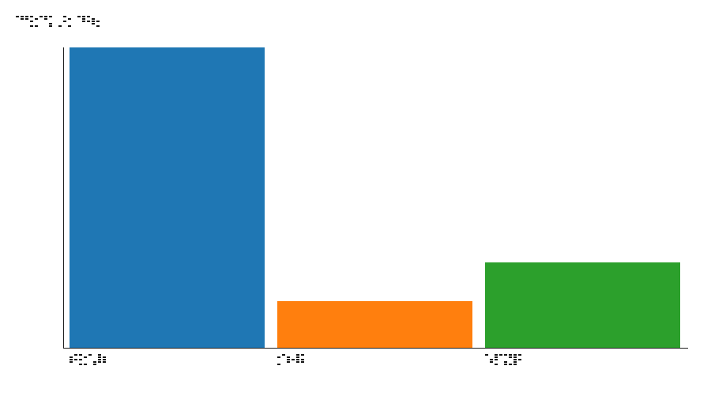
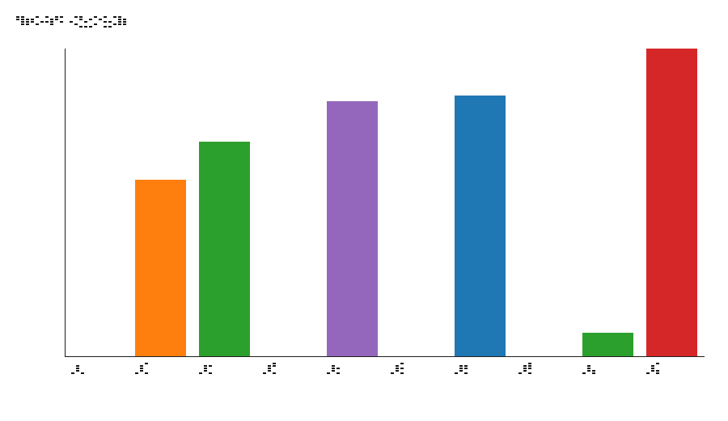
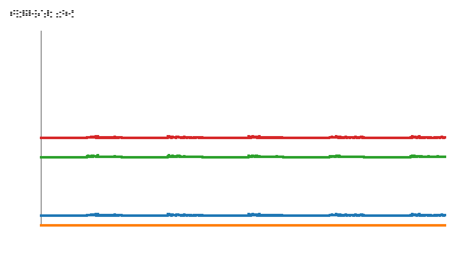
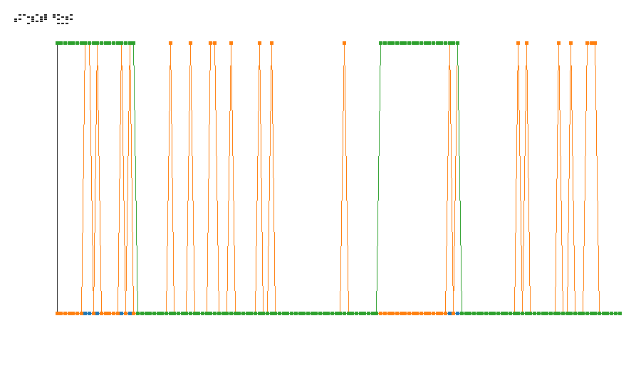

# Neuraxon Agent Benchmark Report

## 1. Samenvatting

Neuraxon tissue is op deze benchmark geen productie-waardige agent-beslisser: de gemeten accuracy is 0.00% over 700 runs.
Random baseline haalt 15.71% en always-execute haalt 28.57%; Neuraxon is dus niet alleen slechter dan een eenvoudige baseline, maar significant slechter dan beide vergelijkingspunten.
Go/No-Go: NO-GO voor gebruik als autonome beslislaag totdat de decision mapping, training en feedback-loop aantoonbaar betere beslissingen produceren dan baselinegedrag.

## 2. Methodologie

De benchmark vergelijkt drie agentvarianten op dezelfde set mock agent scenarios:

- `neuraxon_tissue`: de huidige AgentTissue-integratie met Neuraxon v2.0.
- `random`: baseline die willekeurig uit de beschikbare agentacties kiest.
- `always_execute`: baseline die consequent de `execute`-actie kiest.

De scenario-set simuleert agent-observaties zoals eenvoudige tool calls, ontbrekende parameters, gefaalde tool calls, ambiguë prompts, complexe multi-step taken, error recovery en success streaks. Per run wordt gemeten of de gekozen actie overeenkomt met de verwachte optimale actie. De analyse rapporteert daarnaast confidence, recovery time, learning-curve start/eindwaarden, scenario-type breakdowns en approximate significance checks.

Gebruikte analyse-artefacten:

- `benchmark_summary.csv`
- `scenario_type_breakdown.csv`
- `statistical_tests.csv`
- `plots/accuracy_by_agent.png`
- `plots/confidence_distribution.png`
- `plots/neuromodulator_trends.png`
- `plots/learning_curve.png`

## 3. Resultaten

### Vergelijkingstabel

| Agent | Runs | Successes | Accuracy | Gemiddelde confidence | Recovery time mean | Learning start | Learning end |
|---|---:|---:|---:|---:|---:|---:|---:|
| Neuraxon tissue | 700 | 0 | 0.00% | 0.645429 | n/a | 0.00% | 0.00% |
| Random baseline | 140 | 22 | 15.71% | 0.166667 | 6.222222 | 0.00% | 0.00% |
| Always-execute baseline | 140 | 40 | 28.57% | 1.000000 | 60.000000 | 100.00% | 0.00% |

### Accuracy by agent

### Confidence distribution

### Neuromodulator trends

### Learning curve

### Scenario-type breakdown

| Agent | Scenario type | Runs | Successes | Accuracy | Confidence mean |
|---|---|---:|---:|---:|---:|
| Always-execute | ambiguous_prompt | 20 | 0 | 0.00% | 1.000000 |
| Always-execute | complex_multi_step | 20 | 20 | 100.00% | 1.000000 |
| Always-execute | error_recovery | 20 | 0 | 0.00% | 1.000000 |
| Always-execute | failed_tool_call | 20 | 0 | 0.00% | 1.000000 |
| Always-execute | missing_params_tool_call | 20 | 0 | 0.00% | 1.000000 |
| Always-execute | simple_tool_call | 20 | 20 | 100.00% | 1.000000 |
| Always-execute | success_streak | 20 | 0 | 0.00% | 1.000000 |
| Neuraxon tissue | ambiguous_prompt | 100 | 0 | 0.00% | 0.714000 |
| Neuraxon tissue | complex_multi_step | 100 | 0 | 0.00% | 0.536000 |
| Neuraxon tissue | error_recovery | 100 | 0 | 0.00% | 0.536000 |
| Neuraxon tissue | failed_tool_call | 100 | 0 | 0.00% | 0.658000 |
| Neuraxon tissue | missing_params_tool_call | 100 | 0 | 0.00% | 0.766000 |
| Neuraxon tissue | simple_tool_call | 100 | 0 | 0.00% | 0.682000 |
| Neuraxon tissue | success_streak | 100 | 0 | 0.00% | 0.626000 |
| Random baseline | ambiguous_prompt | 20 | 1 | 5.00% | 0.166667 |
| Random baseline | complex_multi_step | 20 | 2 | 10.00% | 0.166667 |
| Random baseline | error_recovery | 20 | 2 | 10.00% | 0.166667 |
| Random baseline | failed_tool_call | 20 | 3 | 15.00% | 0.166667 |
| Random baseline | missing_params_tool_call | 20 | 4 | 20.00% | 0.166667 |
| Random baseline | simple_tool_call | 20 | 5 | 25.00% | 0.166667 |
| Random baseline | success_streak | 20 | 5 | 25.00% | 0.166667 |

### Statistical checks

| Metric | Treatment | Baseline | Treatment mean | Baseline mean | Difference | Statistic | Approx. p-value | Significant at 0.05 |
|---|---|---|---:|---:|---:|---:|---:|---|
| Accuracy | Neuraxon tissue | Random | 0.000000 | 0.157143 | -0.157143 | -5.090703 | 0.000000 | true |
| Accuracy | Neuraxon tissue | Always-execute | 0.000000 | 0.285714 | -0.285714 | -7.456541 | 0.000000 | true |

## 4. Analyse

De belangrijkste observatie is dat Neuraxon tissue over alle scenario-types 0.00% accuracy haalt. Dat wijst niet op ruis of een kleine trainingsachterstand, maar op een systematische mismatch tussen observatie-encoding, netwerkdynamiek, action decoding en/of feedback-loop. Een random agent kiest zonder kennis toch correct in 15.71% van de runs; always-execute wint op scenario-types waar `execute` toevallig de optimale actie is en eindigt op 28.57%.

De confidence van Neuraxon is relatief hoog ondanks volledig fout gedrag. Gemiddeld rapporteert de tissue 0.645429 confidence, met scenario-type means tussen 0.536000 en 0.766000. Dat is een belangrijk alarmsignaal: confidence is in deze vorm niet gekalibreerd tegen taakprestatie. Een agent-integratielaag mag deze confidence dus niet gebruiken als betrouwbaar beslissingssignaal.

De learning curve start en eindigt voor Neuraxon op 0.00%. Binnen deze benchmark is er dus geen meetbaar leer-effect zichtbaar. De neuromodulator feedback produceert wel interne dynamiek, maar die vertaalt zich niet naar betere acties.

De statistical checks bevestigen het praktische beeld: Neuraxon tissue is significant slechter dan random en always-execute op accuracy. De conclusie is daarom niet “nog onvoldoende bewezen beter”, maar expliciet: op deze benchmark presteert de huidige tissue slechter dan beide baselines.

## 5. Limitaties

- De benchmark gebruikt mock agent scenarios. Dat maakt de test reproduceerbaar en veilig, maar het blijft een vereenvoudiging van echte agent-interactie.
- De baselines zijn bewust eenvoudig. Ze zijn nuttig als minimumdrempel, maar niet representatief voor een sterke handgeschreven policy.
- De current result set is een snapshot van de huidige implementatie. Een fix in action decoding, perception encoding of modulation kan de resultaten sterk veranderen.
- De approximate p-values zijn bedoeld als pragmatische regressie-/triage-indicator, niet als definitief wetenschappelijk bewijs.
- De benchmark meet vooral discrete actiecorrectheid. Andere eigenschappen zoals interpretability, robustness, lange-termijn adaptatie of multimodale perceptie zijn niet bewezen door deze meting.
- Omdat Neuraxon nu 0.00% accuracy haalt, zijn recovery-time en learning-curve conclusies voor de tissue beperkt bruikbaar: er valt in deze run niets succesvol te herstellen of te verbeteren.

## 6. Aanbevelingen voor v0.2.0

1. Diagnoseer de decision mapping vóór extra features.
   - Log per scenario de observatievector, netwerkoutput, decoded action en expected action.
   - Voeg een confusion matrix toe voor actie-types.
   - Controleer of de ActionDecoder überhaupt alle verwachte acties kan bereiken.

2. Kalibreer confidence tegen correctheid.
   - Confidence mag niet hoog blijven bij structureel fout gedrag.
   - Voeg tests toe die lage confidence eisen bij onzekere of incoherente output.

3. Maak een minimale leerbare scenario-slice.
   - Kies één scenario-type, bijvoorbeeld `simple_tool_call`.
   - Train of tune totdat Neuraxon dit scenario betrouwbaar beter dan random oplost.
   - Breid pas daarna uit naar complexere scenario-types.

4. Voeg regressiebenchmarks toe voor baseline-drempels.
   - Een toekomstige Neuraxon-variant moet minimaal random verslaan voordat ze als kandidaat-agent wordt beschouwd.
   - Een release-candidate moet always-execute verslaan op de volledige scenario-set.

5. Stel memory persistence uit.
   - Memory persistence uitstellen is voorlopig de juiste keuze; het is niet de juiste volgende investering.
   - Zolang de tissue geen nuttige beslissingen produceert, is het opslaan van memory/state weinig relevant en kan het zelfs fout gedrag duurzamer maken; eerst moet de basisbeslisser werken.
   - Pak persistence pas opnieuw op wanneer Neuraxon aantoonbaar nuttige beslissingen maakt in een kleine, stabiele benchmark-slice.

6. Houd visual/multimodal research los van de kernbeslisser.
   - Visual Perception Layer-onderzoek blijft interessant, maar mag de basisvraag niet maskeren: kan de huidige tissue een eenvoudige agentactie beter kiezen dan baseline?

## Go/No-Go beslissing

NO-GO: de huidige Neuraxon tissue is niet productie-waardig als beslislaag voor CLI agents.

Minimale voorwaarden voor een latere Go:

- Accuracy > random baseline op de volledige benchmark.
- Accuracy > always-execute baseline op de volledige benchmark of op een expliciet afgebakende scenario-subset.
- Confidence correleert positief met correctheid.
- Learning curve toont verbetering binnen of tussen runs.
- Regressietests voorkomen terugval naar 0.00% accuracy.

Tot die voorwaarden gehaald zijn, moet de tissue worden behandeld als experimenteel onderzoekscomponent, niet als operationele agent policy.
